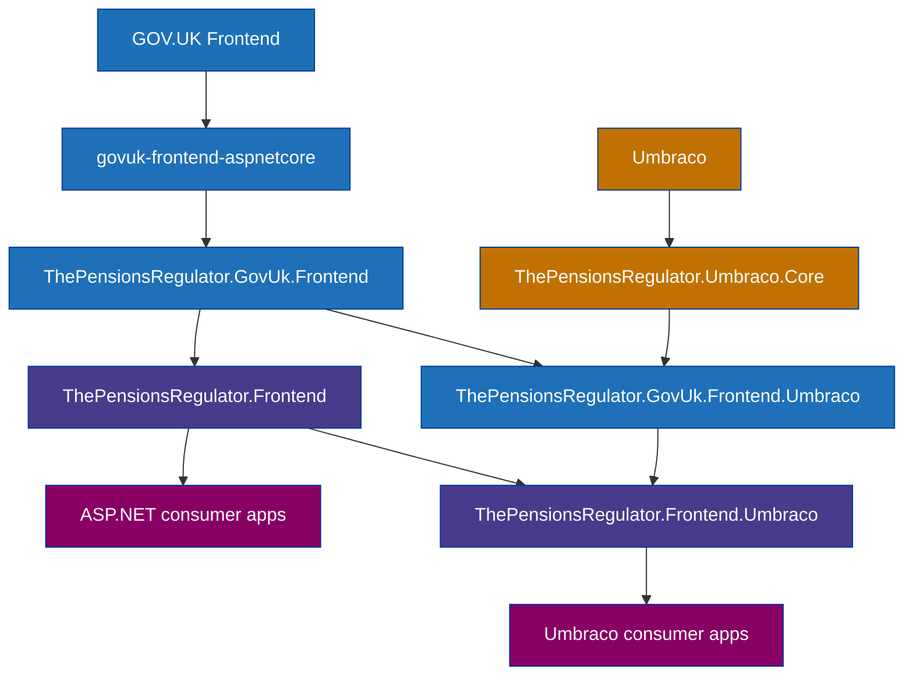

# Contributing to govuk-frontend-aspnetcore-extensions

This project prioritises the components required by The Pensions Regulator (TPR). Please open an issue if you find a bug, want to request improvements to a component we already support, or wish to implement a component we do not yet support. Pull requests are welcome.

We also encourage contributions to the base project we're building upon, [govuk-frontend-aspnetcore](https://github.com/x-govuk/govuk-frontend-aspnetcore).

## Architecture

We use GOV.UK Frontend code directly, including GOV.UK Frontend HTML implemented by `govuk-frontend-aspnetcore`.

We support ASP.NET MVC applications without Umbraco via the following projects:

- `ThePensionsRegulator.GovUk.Frontend`
- `ThePensionsRegulator.Frontend`

**These projects must never have any references to Umbraco.**

We support ASP.NET applications with Umbraco via the following projects:

- `ThePensionsRegulator.Umbraco.Core`
- `ThePensionsRegulator.GovUk.Frontend.Umbraco`
- `ThePensionsRegulator.Frontend.Umbraco`

This dependencies are illustrated by the following diagram:

## Guidance

- [Update govuk-frontend-aspnetcore and GOV.UK Frontend](/docs/contributing/update-govuk-frontend.md)
- [Include SASS files in packages for consuming applications to use](/docs/contributing/include-sass-in-packages.md)
- [Umbraco backoffice development](/docs/contributing/backoffice-development.md)
- [Use GOV.UK and TPR styles in the Umbraco backoffice](/docs/contributing/use-styles-in-backoffice.md)
- [Where to add settings in Umbraco](/docs/contributing/where-to-add-settings-in-umbraco.md)
- [Include client-side files in packages](/docs/contributing/include-client-side-files-in-packages.md)
- [TypeScript for client-side scripts](/docs/contributing/typescript-development.md)
- [Allow a TPR component as a child of a GOV.UK component](/docs/contributing/allow-tpr-component.md)
- [Run tests](/docs/contributing/run-tests.md)
- [Test pre-release NuGet packages](/docs/contributing/test-nuget-packages.md)
- [Publish a new version to nuget.org](/docs/contributing/publish-to-nuget.md)
