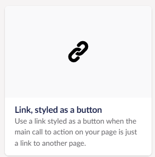

# Button

Implements the [Button component](https://github.com/x-govuk/govuk-frontend-aspnetcore/blob/main/docs/components/button.md) from the GOV.UK Design System.  
See [ASP.NET syntax for the Button component](https://github.com/x-govuk/govuk-frontend-aspnetcore/blob/main/docs/components/button.md) for usage examples.

## Umbraco Integration

You can add a Button component to a block grid or block list in Umbraco.  
For usage examples, see the 'Button' page in the Umbraco example app.

### Link Styled as a Button component



If you use the `Link, styled as a button` component:

- When you select **Opens the linked document in a new window or tab**, a visually hidden span is automatically added inside the link to notify screen reader users that the link opens in a new tab.

  ```html
  <span class="govuk-visually-hidden">(opens in new tab)</span>
  ```

- The text inside the span is defined by the `OpensInNewTab` dictionary value in `DictionaryConstants.cs`