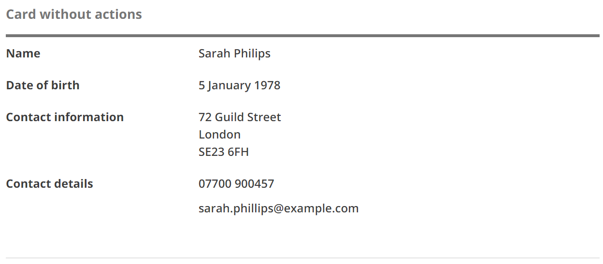

# Summary card

[GDS Summary card component](https://design-system.service.gov.uk/components/summary-list/#summary-cards)

## Example - with actions

```razor
 <govuk-summary-card>
    <govuk-summary-card-title>Card title</govuk-summary-card-title>
    <govuk-summary-card-actions>
        <govuk-summary-card-action href="https://example.org/change" visually-hidden-text="card title">Change</govuk-summary-card-action>
        <govuk-summary-card-action href="https://example.org/remove" visually-hidden-text="card title">Remove</govuk-summary-card-action>
    </govuk-summary-card-actions>
    <govuk-summary-list>
        <govuk-summary-list-row>
            <govuk-summary-list-row-key>
                Name
            </govuk-summary-list-row-key>
            <govuk-summary-list-row-value>
                Sarah Philips
            </govuk-summary-list-row-value>
        </govuk-summary-list-row>
        <govuk-summary-list-row>
            <govuk-summary-list-row-key>
                Date of birth
            </govuk-summary-list-row-key>
            <govuk-summary-list-row-value>
                5 January 1978
            </govuk-summary-list-row-value>
        </govuk-summary-list-row>
        <govuk-summary-list-row>
            <govuk-summary-list-row-key>
                Contact information
            </govuk-summary-list-row-key>
            <govuk-summary-list-row-value>
                72 Guild Street<br>London<br>SE23 6FH
            </govuk-summary-list-row-value>
        </govuk-summary-list-row>
        <govuk-summary-list-row>
            <govuk-summary-list-row-key>
                Contact details
            </govuk-summary-list-row-key>
            <govuk-summary-list-row-value>
                <p class="govuk-body">07700 900457</p><p class="govuk-body">sarah.phillips@example.com</p>
            </govuk-summary-list-row-value>
        </govuk-summary-list-row>
    </govuk-summary-list>
</govuk-summary-card>
```

This example has GOV.UK styling:


This example has TPR styling:


## Example - without actions

```razor
 <govuk-summary-card>
    <govuk-summary-card-title>Card title</govuk-summary-card-title>
    <govuk-summary-list>
        <govuk-summary-list-row>
            <govuk-summary-list-row-key>
                Name
            </govuk-summary-list-row-key>
            <govuk-summary-list-row-value>
                Sarah Philips
            </govuk-summary-list-row-value>
        </govuk-summary-list-row>
        <govuk-summary-list-row>
            <govuk-summary-list-row-key>
                Date of birth
            </govuk-summary-list-row-key>
            <govuk-summary-list-row-value>
                5 January 1978
            </govuk-summary-list-row-value>
        </govuk-summary-list-row>
        <govuk-summary-list-row>
            <govuk-summary-list-row-key>
                Contact information
            </govuk-summary-list-row-key>
            <govuk-summary-list-row-value>
                72 Guild Street<br>London<br>SE23 6FH
            </govuk-summary-list-row-value>
        </govuk-summary-list-row>
        <govuk-summary-list-row>
            <govuk-summary-list-row-key>
                Contact details
            </govuk-summary-list-row-key>
            <govuk-summary-list-row-value>
                <p class="govuk-body">07700 900457</p><p class="govuk-body">sarah.phillips@example.com</p>
            </govuk-summary-list-row-value>
        </govuk-summary-list-row>
    </govuk-summary-list>
</govuk-summary-card>
```

This example has GOV.UK styling:


This example has TPR styling:



## API

### `<govuk-summary-card>`

_Required_

### `<govuk-summary-card-title>`

_Required_

| Attribute       | Type  | Description                                                                                                |
| --------------- | ----- | ---------------------------------------------------------------------------------------------------------- |
| `heading-level` | `int` | The heading level for the summary card title. Must be between `1` and `6` (inclusive). The default is `2`. |

Must be inside a `<govuk-summary-card>` element.

### `<govuk-summary-card-actions>`

The container element for the card's actions, if any.\
Must be inside a `<govuk-summary-card>` element.

### `<govuk-summary-card-action>`

| Attribute              | Type     | Description                                      |
| ---------------------- | -------- | ------------------------------------------------ |
| `href`                 | `string` | The `href` attribute for the link.               |
| `visually-hidden-text` | `string` | The visually hidden text for the link. Optional. |

The content is the HTML to use within the generated link.\
Must be inside a `<govuk-summary-card-actions>` element.

### `<govuk-summary-list>`

_Required_

See [Summary list](https://github.com/gunndabad/govuk-frontend-aspnetcore/blob/main/docs/components/summary-list.md) for details.

## Umbraco

Add the 'Summary card' component to a block list, and add 'Summary card action' and 'Summary list item' components to the 'Summary card'.


The card title will automatically be used as visually-hidden text on each action.

You can also supply card actions and summary list items at runtime from a database or other data source.

```csharp
using ThePensionsRegulator.Umbraco.BlockLists;
using GovUk.Frontend.Umbraco.BlockLists;
using GovUk.Frontend.Umbraco.Models;
using Umbraco.Cms.Core.PublishedCache;
using Umbraco.Cms.Web.Common.PublishedModels;

public class ExampleController : RenderController
{
    private readonly IPublishedValueFallback _publishedValueFallback;
    private readonly IPublishedSnapshotAccessor _publishedSnapshotAccessor;

    public ExampleController(ILogger<RenderController> logger,
        ICompositeViewEngine compositeViewEngine,
        IUmbracoContextAccessor umbracoContextAccessor,
        IPublishedValueFallback publishedValueFallback,
        IPublishedSnapshotAccessor publishedSnapshotAccessor
        ) : base(logger, compositeViewEngine, umbracoContextAccessor)
    {
        _publishedValueFallback = publishedValueFallback;
        _publishedSnapshotAccessor = publishedSnapshotAccessor;
    }

    [ModelType(typeof(ExampleViewModel))]
    public override IActionResult Index()
    {
        var viewModel = new ExampleViewModel
        {
            Page = new ExampleModelsBuilderModel(CurrentPage, _publishedValueFallback)
        };

        var cardAction = new SummaryListAction(new Link { Url = "https://www.example.org/act-on-the-card" }, "Change");

        var listItem = new SummaryListItem("Example key", new HtmlEncodedString("<em>The value</em>"));
        listItem.Actions.Add(new SummaryListAction(new Link { Url = "https://www.example.org/change-the-thing" }, "Change"));

        var block = viewModel.Page.Blocks.FindBlockByContentTypeAlias(GovukSummaryList.ModelTypeAlias);
        block.Content.OverrideSummaryCardActions(new[] { cardAction }, _publishedSnapshotAccessor);
        block.Content.OverrideSummaryListItems(new[] { listItem }, _publishedSnapshotAccessor);

        return CurrentTemplate(viewModel);
    }
}
```
