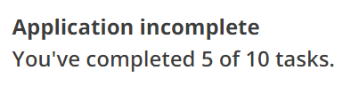

# Task list summary

This is part of the [Task list pages](https://design-system.service.gov.uk/patterns/task-list-pages/) pattern.

## Example

```razor
<govuk-task-list-summary
       heading-level="2"
       incomplete-status="Application incomplete"
       completed-status="Application completed"
       tracker="You've completed {0} of {1} tasks."
       total-tasks="10"
       completed-tasks="5" />
```



## API

### `<govuk-task-list-summary>`

| Attribute           | Type     | Description                                                                                                                                                                                                      |
| ------------------- | -------- | ---------------------------------------------------------------------------------------------------------------------------------------------------------------------------------------------------------------- |
| `heading-level`     | `int`    | The heading level. Must be between `1` and `6` (inclusive). The default is `1`.                                                                                                                                  |
| `incomplete-status` | `string` | The heading to display when the task list is incomplete. The default is "Tasks incomplete".                                                                                                                      |
| `completed-status`  | `string` | The heading to display when the task list is completed. The default is "Tasks completed".                                                                                                                        |
| `tracker`           | `string` | Text that displays how many tasks are completed. `{0}` is replaced with the number of completed tasks, and `{1}` is replaced with the total number of tasks. The default is "You've completed {0} of {1} tasks." |
| `total-tasks`       | `int`    | The total number of tasks in the task list that must be completed.                                                                                                                                               |
| `completed-tasks`   | `int`    | The number of tasks in the task list that have been completed so far.                                                                                                                                            |

## Umbraco

When you add a 'Task list summary' component to a block list in Umbraco, it will automatically display the count of tasks for all 'Task list' components in the same block list or its descendants.
