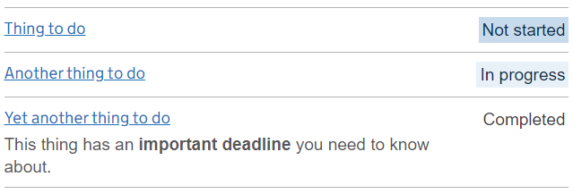
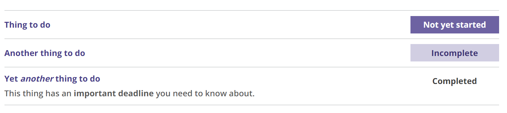

# Task list

[Task list component (pre-release)](https://deploy-preview-1994--govuk-design-system-preview.netlify.app/components/task-list/)

## Example

```razor
 <govuk-task-list>
    <govuk-task-list-task href="https://example.org/task-1">
        <govuk-task-list-task-name>Thing to do</govuk-task-list-task-name>
        <govuk-task-list-task-status status="NotStarted">Not yet started</govuk-task-list-task-status>
    </govuk-task-list-task>
    <govuk-task-list-task href="https://example.org/task-2">
        <govuk-task-list-task-name>Another thing to do</govuk-task-list-task-name>
        <govuk-task-list-task-status status="Incomplete" />
    </govuk-task-list-task>
    <govuk-task-list-task href="https://example.org/task-3">
        <govuk-task-list-task-name>Yet <i>another</i> thing to do</govuk-task-list-task-name>
        <govuk-task-list-task-hint>This thing has an <strong>important deadline</strong> you need to know about.</govuk-task-list-task-hint>
        <govuk-task-list-task-status status="Completed" />
    </govuk-task-list-task>
</govuk-task-list>
```

This example has GOV.UK styling:



This example has TPR styling:



## API

### `<govuk-task-list>`

_Required_

### `<govuk-task-list-task>`

_Required_

| Attribute | Type     | Description                     |
| --------- | -------- | ------------------------------- |
| `href`    | `string` | The link to the task. Optional. |

Must be inside a `<govuk-task-list>` element.

### `<govuk-task-list-task-name>`

_Required_\
The content is the HTML to use as the task name.\
Must be inside a `<govuk-task-list-task>` element.

### `<govuk-task-list-task-hint>`

The content is the HTML to use as the hint below the task name. Do not include links as they will not be clickable. \
Must be inside a `<govuk-task-list-task>` element.

### `<govuk-task-list-task-status>`

| Attribute | Type                 | Description                       |
| --------- | -------------------- | --------------------------------- |
| `status`  | `TaskListTaskStatus` | The status of the task. Optional. |

The content is the status tag, if it needs to be different from the value of the `status` attribute.\
Must be inside a `<govuk-task-list-task>` element.

## Umbraco

Add the 'Task list' component to a block list, and add 'Task' components to the 'Task list'.


Adding formatting (for example, bold text) in the task name is not currently supported in Umbraco.

The default text of each status can be changed or localised by adding a dictionary entry called `Task list - {status}`. For example, change 'Incomplete' to 'In progress' by creating a dictionary entry called `Task list - Incomplete` and setting the value to 'In progress'.

Use the 'Status text' property to override the status text for an individual task when using the dictionary entry is not flexible enough for your application.
