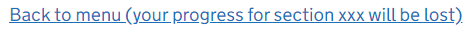
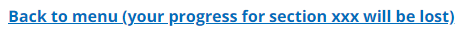

# TPR back to menu

TPR back to menu is a TPR component which enables the user to cancel a multi-page transaction.

In testing users were confused by a standard 'Cancel' link as they weren't sure how much of their transaction would be cancelled, so 'TPR back to menu' allows room for an explanation of the scope.

## Example

```razor
<tpr-back-to-menu href="/">Back to menu (your progress for section xxx will be lost)</tpr-back-to-menu>
```

This example has GOV.UK styling:



This example has TPR styling:



## API

### `<tpr-back-to-menu>`

| Attribute | Type     | Description         |
| --------- | -------- | ------------------- |
| `href`    | `string` | The URL to link to. |

## Umbraco

Add the 'Back to menu' component to a block list.


