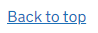
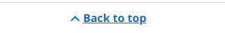

# TPR back to top

A back to top component is [proposed for the GOV.UK Design System](https://github.com/alphagov/govuk-design-system-backlog/issues/5). TPR back to top is an implementation of the same pattern to a TPR design.

## Example

```razor
<tpr-back-to-top href="#main">Back to top</tpr-back-to-top>
```

This example has GOV.UK styling:



This example has TPR styling:



## Client-side support

When JavaScript is enabled the component is hidden on short pages. Include the following script to enable this behaviour. This is included by default when referencing `<partial name="TPR/Head" />` in your layout.

```html
<script src="/_content/ThePensionsRegulator.GovUk.Frontend/tpr/tpr-back-to-top.js"></script>
```

## API

### `<tpr-back-to-top>`

| Attribute | Type     | Description            |
| --------- | -------- | ---------------------- |
| `href`    | `string` | The anchor to link to. |

## Umbraco

Add the 'TPR back to top' composition to one of your document types, typically a 'Settings' document type without a template that you allow at the root of the content tree.


Create or edit a content node based on your document type, and you will be able to specify text for the TPR back to top component.


Finally, pass that content node to the `TPRFooterLockup` partial view on your layout to add the typical combination of TPR back to top and [TPR footer bar](tpr-footer-bar.md) to your application.

```razor
@using GovUk.Frontend.Umbraco.Models;
@using Umbraco.Cms.Web.Common
@inject UmbracoHelper Umbraco
@{
    var settings = Umbraco.ContentSingleAtXPath("//settings");
    var footerLockup = new TprFooterLockupModel(settings!);
}

...

<partial name="TPR/TPRFooterLockup" model="footerLockup" />
```
