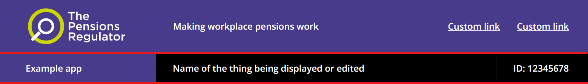

# TPR context bar

The Pensions Regulator (TPR) uses the TPR context bar as an optional part of the TPR header.

## Example

```razor
 <tpr-context-bar>
    <tpr-context-bar-context-1>Example app</tpr-context-bar-context-1>
    <tpr-context-bar-context-2>Name of the thing being displayed or edited</tpr-context-bar-context-2>
    <tpr-context-bar-context-3 allow-html="true">
        ID: 12345678<br />
        Ref: 12345678
    </tpr-context-bar-context-3>
</tpr-context-bar>
```

The red lines in this screenshot highlight the TPR context bar within the TPR header:



[Run the Umbraco example application](docs/umbraco/run-example-application.md) and see 'The Pensions Regulator (TPR) header and footer' for more examples.

## API

### `<govuk-context-bar>`

_Required_

### `<govuk-context-bar-context-1>`

Typically used for the name of the application. If the name of the application is in the TPR header bar, the mode the application is in may go here.

| Attribute    | Type   | Description                                                       |
| ------------ | ------ | ----------------------------------------------------------------- |
| `allow-html` | `bool` | Sets whether to render HTML without escaping. Default is `false`. |

Must be inside a `<govuk-context-bar>` element.

### `<govuk-context-bar-context-2>`

Typically used for the name of the thing being displayed or edited.

| Attribute    | Type   | Description                                                       |
| ------------ | ------ | ----------------------------------------------------------------- |
| `allow-html` | `bool` | Sets whether to render HTML without escaping. Default is `false`. |

Must be inside a `<govuk-context-bar>` element.

### `<govuk-context-bar-context-3>`

Typically used for an identifier of the thing being displayed or edited.

| Attribute    | Type   | Description                                                       |
| ------------ | ------ | ----------------------------------------------------------------- |
| `allow-html` | `bool` | Sets whether to render HTML without escaping. Default is `false`. |

Must be inside a `<govuk-context-bar>` element.

## Umbraco

Add the 'TPR context 1', 'TPR context 2' and 'TPR context 3' compositions to one of your document types, typically a 'Settings' document type without a template that you allow at the root of the content tree.


Create or edit a content node based on your document type, and you will be able to specify text for the context bar.


Finally, pass that content node to the `TPRHeaderLockup` partial view on your layout to add the typical combination of [Skip link](https://design-system.service.gov.uk/components/skip-link/), [Phase banner](https://design-system.service.gov.uk/components/phase-banner/), [TPR header bar](tpr-header-bar.md) and TPR context bar to your application.

```razor
@using GovUk.Frontend.Umbraco.Models;
@using Umbraco.Cms.Web.Common
@inject UmbracoHelper Umbraco
@{
    var settings = Umbraco.ContentSingleAtXPath("//settings");
    var headerLockup = new TprHeaderLockupModel(settings!);
}

...

<partial name="TPR/TPRHeaderLockup" model="headerLockup" />
```
