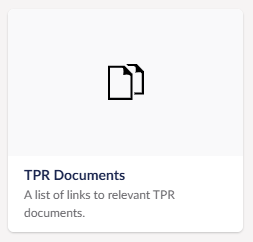
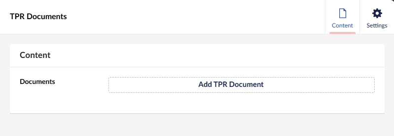
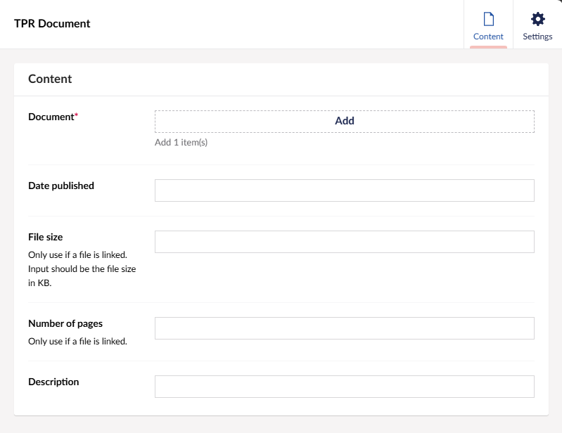
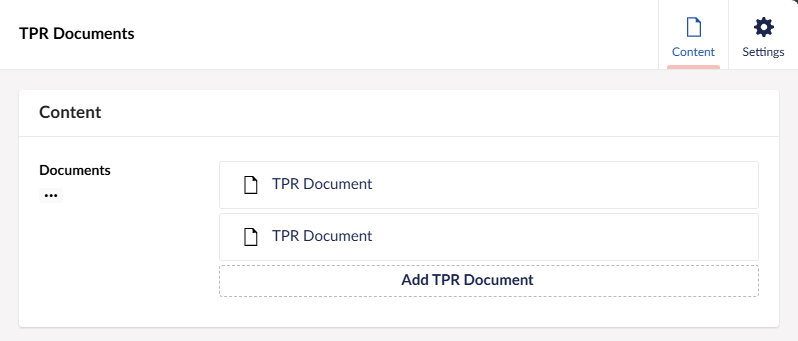
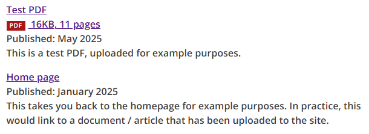

# TPR Documents

A design component that can be used to display a list of documents, this component is implemented using tag helpers and can be used in Umbraco applications by selecting the 'TPR Documents' block in either the TPR Block Grid or TPR Block List.

## Example

The 'TPR Documents' block is supported on the 'TPR Block Grid' and 'TPR Block List' components in Umbraco. The block should look like this:



Once you have clicked on the block, an inner custom Block List will appear that only allows for a TPR Document:



After pressing 'Add TPR Document' the following menu should appear, prompting you to link the documet as well as fill out any relevant information about the document. The 'File size' and 'Number of pages' fields should only be filled out if the document you are linking to is a piece of media such as a .PDF or .DOCX file.



After adding a couple of documents to the list, it should look like so:



This is what the generated HTML should look like, as well as what is displayed on the screen:

```html
<dl class="tpr-documents govuk-body">
  <div class="tpr-document ">
    <dt><a href='/media/qubju2bv/testpdf.pdf'>Test PDF<br><span class='pdf fileicon'>PDF</span> 16KB, 11 pages </dt></a href='/media/qubju2bv/testpdf.pdf'>
    <dd>Published: May 2025</dd>
    <dd>This is a test PDF, uploaded for example purposes.</dd>
  </div>
  <div class="tpr-document ">
    <dt><a href='/'>Home page</a href='/'></dt>
    <dd>Published: January 2025</dd>
    <dd>This takes you back to the homepage for example purposes. In practice, this would link to a document / article that has been uploaded to the site.</dd>
  </div>
</dl>
```


