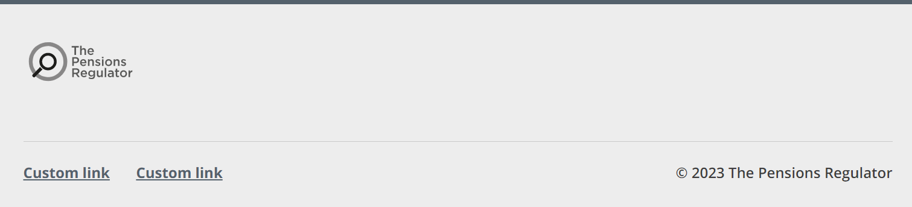

# TPR footer bar

The Pensions Regulator (TPR) uses the TPR footer bar as the footer on its web pages.

## Example

```razor
 <tpr-footer-bar>
    <tpr-footer-bar-logo href="https://example.org" alt="Go to example" />
    <tpr-footer-bar-copyright>2023 The Pensions Regulator</tpr-footer-bar-copyright>
    <tpr-footer-bar-content>
        <a class="govuk-link" href="#">A link</a>
        <a class="govuk-link" href="#">Another link</a>
    </tpr-footer-bar-content>
</tpr-footer-bar>
```



[Run the Umbraco example application](docs/umbraco/run-example-application.md) and see 'The Pensions Regulator (TPR) header and footer' for more examples.

## API

### `<govuk-footer-bar>`

_Required_

### `<govuk-footer-bar-logo>`

Configures the TPR logo, which links to The Pensions Regulator's website by default.

| Attribute | Type     | Description                                                                                    |
| --------- | -------- | ---------------------------------------------------------------------------------------------- |
| `href`    | `string` | Sets the URL the logo links to, if any. Default is `https://www.thepensionsregulator.gov.uk/`. |
| `alt`     | `string` | Sets the alternative text for the logo. Default is `The Pensions Regulator home page`.         |

Must be inside a `<govuk-footer-bar>` element.

### `<govuk-footer-bar-copyright>`

Sets the copyright notice that follows the copyright symbol.

| Attribute    | Type   | Description                                                       |
| ------------ | ------ | ----------------------------------------------------------------- |
| `allow-html` | `bool` | Sets whether to render HTML without escaping. Default is `false`. |

Must be inside a `<govuk-footer-bar>` element.

### `<govuk-footer-bar-content>`

Typically used for a menu of relevant links.

| Attribute    | Type   | Description                                                       |
| ------------ | ------ | ----------------------------------------------------------------- |
| `allow-html` | `bool` | Sets whether to render HTML without escaping. Default is `false`. |

Must be inside a `<govuk-footer-bar>` element.

## Umbraco

Add the 'TPR footer' composition to one of your document types, typically a 'Settings' document type without a template that you allow at the root of the content tree.


Create or edit a content node based on your document type, and you will be able to specify text for the footer bar.


Finally, pass that content node to the `TPRFooterLockup` partial view on your layout to add the typical combination of [TPR back to top](tpr-back-to-top.md) and TPR footer bar to your application.

```razor
@using GovUk.Frontend.Umbraco.Models;
@using Umbraco.Cms.Web.Common
@inject UmbracoHelper Umbraco
@{
    var settings = Umbraco.ContentSingleAtXPath("//settings");
    var footerLockup = new TprFooterLockupModel(settings!);
}

...

<partial name="TPR/TPRFooterLockup" model="footerLockup" />
```
