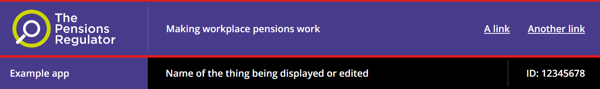

# TPR header bar

The Pensions Regulator (TPR) uses the TPR header bar as a consistent part of the TPR header.

## Example

```razor
 <tpr-header-bar>
    <tpr-header-bar-logo href="https://example.org" alt="Go to example" />
    <tpr-header-bar-label>Making workplace pensions work</tpr-header-bar-label>
    <tpr-header-bar-content>
        <a class="govuk-link" href="#">A link</a>
        <a class="govuk-link" href="#">Another link</a>
    </tpr-header-bar-content>
</tpr-header-bar>
```

The red lines in this screenshot highlight the TPR header bar within the TPR header:



## API

### `<govuk-header-bar>`

_Required_

### `<govuk-header-bar-logo>`

Configures the TPR logo, which links to The Pensions Regulator's website by default.

| Attribute | Type     | Description                                                                                    |
| --------- | -------- | ---------------------------------------------------------------------------------------------- |
| `href`    | `string` | Sets the URL the logo links to, if any. Default is `https://www.thepensionsregulator.gov.uk/`. |
| `alt`     | `string` | Sets the alternative text for the logo. Default is `The Pensions Regulator home page`.         |

Must be inside a `<govuk-header-bar>` element.

### `<govuk-header-bar-label>`

Typically used for the TPR strapline. May be replaced by the name of the application if it consists of smaller parts or operates in different modes that need to be highlighted in the [TPR context bar](tpr-context-bar.md).

| Attribute    | Type   | Description                                                       |
| ------------ | ------ | ----------------------------------------------------------------- |
| `allow-html` | `bool` | Sets whether to render HTML without escaping. Default is `false`. |

Must be inside a `<govuk-header-bar>` element.

### `<govuk-header-bar-content>`

Typically used for a menu of relevant links.

| Attribute    | Type   | Description                                                       |
| ------------ | ------ | ----------------------------------------------------------------- |
| `allow-html` | `bool` | Sets whether to render HTML without escaping. Default is `false`. |

Must be inside a `<govuk-header-bar>` element.

## Umbraco

Add the 'TPR header' composition to one of your document types, typically a 'Settings' document type without a template that you allow at the root of the content tree.


Create or edit a content node based on your document type, and you will be able to specify text for the header bar.


Finally, pass that content node to the `TPRHeaderLockup` partial view on your layout to add the typical combination of [Skip link](https://design-system.service.gov.uk/components/skip-link/), [Phase banner](https://design-system.service.gov.uk/components/phase-banner/), TPR header bar and [TPR context bar](tpr-context-bar.md) to your application.

```razor
@using GovUk.Frontend.Umbraco.Models;
@using Umbraco.Cms.Web.Common
@inject UmbracoHelper Umbraco
@{
    var settings = Umbraco.ContentSingleAtXPath("//settings");
    var headerLockup = new TprHeaderLockupModel(settings!);
}

...

<partial name="TPR/TPRHeaderLockup" model="headerLockup" />
```
