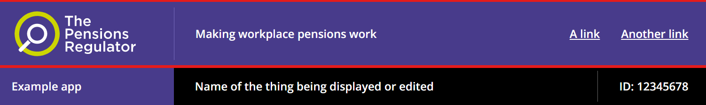

# TPR header bar

The Pensions Regulator (TPR) uses the TPR header bar as a consistent part of the TPR header.

## Example

```razor
@addTagHelper *, ThePensionsRegulator.Frontend

<tpr-header-bar>
    <tpr-header-bar-logo href="https://example.org" alt="Go to example" />
    <tpr-header-bar-label>Making workplace pensions work</tpr-header-bar-label>
    <tpr-header-bar-content>
        <a class="govuk-link" href="#">A link</a>
        <a class="govuk-link" href="#">Another link</a>
    </tpr-header-bar-content>
    <tpr-header-search action="en/search-results" autocomplete-url="#" placeholder="search" aria-label="search" input-query="custom query string"></tpr-header-search>
</tpr-header-bar>
```

The red lines in this screenshot highlight the TPR header bar within the TPR header:



[Run the Umbraco example application](docs/umbraco/run-example-application.md) and see 'The Pensions Regulator (TPR) header and footer' for more examples.

## API

### `<govuk-header-bar>`

_Required_

### `<govuk-header-bar-logo>`

Configures the TPR logo, which links to The Pensions Regulator's website by default.

| Attribute | Type     | Description                                                                                    |
| --------- | -------- | ---------------------------------------------------------------------------------------------- |
| `href`    | `string` | Sets the URL the logo links to, if any. Default is `https://www.thepensionsregulator.gov.uk/`. |
| `alt`     | `string` | Sets the alternative text for the logo. Default is `The Pensions Regulator home page`.         |

Must be inside a `<govuk-header-bar>` element.

### `<govuk-header-bar-label>`

Typically used for the TPR strapline. May be replaced by the name of the application if it consists of smaller parts or operates in different modes that need to be highlighted in the [TPR context bar](tpr-context-bar.md).

| Attribute    | Type   | Description                                                       |
| ------------ | ------ | ----------------------------------------------------------------- |
| `allow-html` | `bool` | Sets whether to render HTML without escaping. Default is `false`. |

Must be inside a `<govuk-header-bar>` element.

### `<govuk-header-bar-content>`

Typically used for a menu of relevant links.

| Attribute    | Type   | Description                                                       |
| ------------ | ------ | ----------------------------------------------------------------- |
| `allow-html` | `bool` | Sets whether to render HTML without escaping. Default is `false`. |

Must be inside a `<govuk-header-bar>` element.


### `<tpr-header-search>`

|    Attribute      | Type   | Description                                                            |
| ----------------- | ------ | ---------------------------------------------------------------------- |
|     `action`      |`string`| Sets action path of search form submission.                            |
|`autocomplete-url` |`string`| Sets endpoint for autocomplete.js fetch operation.                     |
|   `placeholder`   |`string`| Supports setting custom placeholder for generated input elements.      |
|   `aria-label`    |`string`| Programmatically setting aria-label value of button element            |
|   `input-query`   |`string`| Enables configuration so that destination page can choose what query string parameter it wants to handle (value for name attribute on input element). Default value is "query"|
                                                                                           

TPR Header Search will display when there is no header content and DisplayHeaderSearch property is set to true. On smaller screen sizes the TPR mobile menu component will take over, and the header search will display as part of the mobile menu when expanded.
Mobile Menu behaviour has not yet been implemented therefore is a desktop-only component at this time.

TPR Header Search implements the [alphagov/accessible-autocomplete](https://github.com/alphagov/accessible-autocomplete) component, rendering an input box and drop-down box for search results.

Views which require the `<tpr-header-search>` should also include the 'TPRHeaderSearchAutocomplete' partial view, in order to use the autocomplete functionality.

## Umbraco

Add the 'TPR header' composition to one of your document types, typically a 'Settings' document type without a template that you allow at the root of the content tree.


Create or edit a content node based on your document type, and you will be able to specify text for the header bar.


This component has culture variants enabled for localisation purposes.

Finally, pass that content node to the `TPRHeaderLockup` partial view on your layout to add the typical combination of [Skip link](https://design-system.service.gov.uk/components/skip-link/), [Phase banner](https://design-system.service.gov.uk/components/phase-banner/), TPR header bar and [TPR context bar](tpr-context-bar.md) to your application.

```razor
@using GovUk.Frontend.Umbraco.Models;
@using Umbraco.Cms.Web.Common
@inject UmbracoHelper Umbraco
@{
    var settings = Umbraco.ContentSingleAtXPath("//settings");
    var headerLockup = new TprHeaderLockupModel(settings!);
}

...

<partial name="TPR/TPRHeaderLockup" model="headerLockup" />
```
