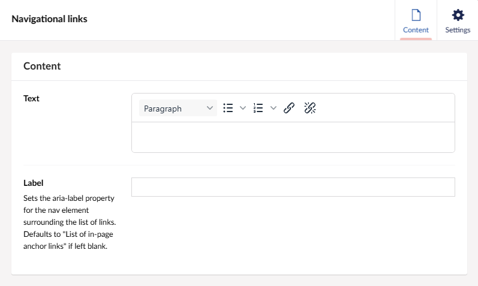

# TPR navigational links

A design component that can be used to display a list of navigational links which can be re-used in TPR Umbraco applications.

## Umbraco example

The 'Navigational links' block is supported within the 'TPR Block Grid' layout in Umbraco. 

After selecting the block, the navigational links component's input fields will appear. Consisting of a rich text editor which has been restricted to links; various list style options; and text font styles, as well as a text box which allows you to override the default aria-label property attached to the nav element surrounding the list of links:

By default the aria-label property for the nav within this component is set to "List of in-page links" to accommodate the most common use case of this component. This value was made overridable to allow for increased usablility in other areas of the site.