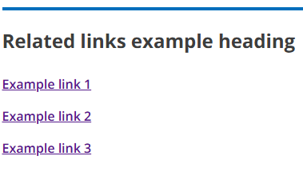
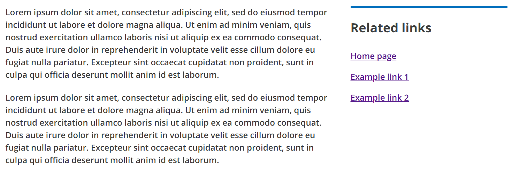
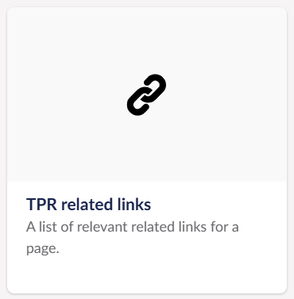
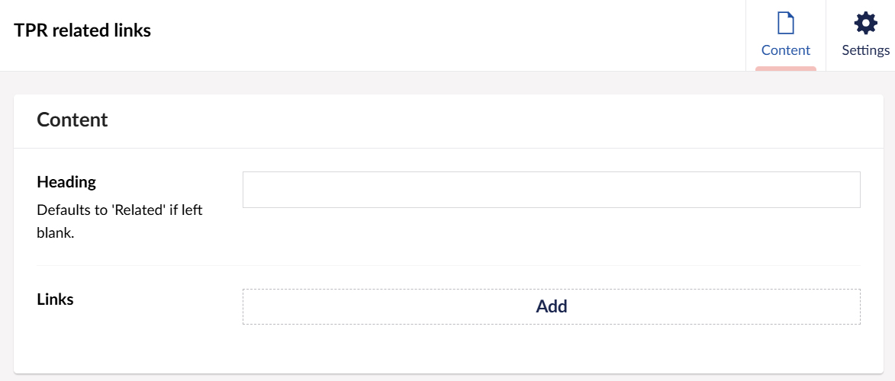

# TPR related links

A design component for the related links column which can be re-used on TPR sites. This component is implemented using tag helpers and can be used in both ASP.NET applications and Umbraco.

## ASP.NET example

```razor
<tpr-related-links>
    <tpr-related-links-heading>Related links example heading</tpr-related-links-heading>
    <tpr-related-link href="/">Example link 1</tpr-related-link>
    <tpr-related-link href="/">Example link 2</tpr-related-link>
    <tpr-related-link href="/">Example link 3</tpr-related-link>
</tpr-related-links>
```

In ASP.NET applications the related links component is structured like so, replacing the example heading and example link placeholders with the required content.

If the tag helpers are arranged like the example above, then it should render the following html code:
```html
<div class='tpr-related-links govuk-body '>
    <ul>
        <li>
            <h2>Related links example heading</h2>
        </li>
        <li>
            <a href="/">Example link 1</a>
        </li>
        <li>
            <a href="/">Example link 2</a>
        </li>
        <li>
            <a href="/">Example link 3</a>
        </li>
    </ul>
</div>
```



## Umbraco example

The 'TPR Related Links' block which is supported on the 'TPR Block Grid' component is used to implement this component in Umbraco. The related links component should only be used in the right-side column of the 'Two thirds / One third' column layout.



To implement this component you should select the 'TPR related links' block:



Then you can add a relevant heading as well as whatever related links are needed for the page:



If the heading is left empty then it will search for a dictionary entry under the 'Translation' tab in Umbraco called 'TPR Related links heading', if there is no dictionary entry under that name then the heading will default to 'Related'.

```razor
@using Umbraco.Cms.Core.Models
@using Umbraco.Cms.Web.Common
@using GovUkPropertyAliases = GovUk.Frontend.Umbraco.PropertyAliases
@using TprPropertyAliases = ThePensionsRegulator.Frontend.Umbraco.PropertyAliases
@inject UmbracoHelper Umbraco
@addTagHelper *, ThePensionsRegulator.Frontend

@{
    var cssClasses = Model.Settings.Value<string>(GovUkPropertyAliases.CssClasses);
    var heading = Model.Content.Value<string>(TprPropertyAliases.TprRelatedLinksHeading);
    var links = Model.Content.Value<IEnumerable<Link>>(TprPropertyAliases.TprRelatedLinksLinks);

    if (string.IsNullOrEmpty(heading)) {
        heading = Umbraco.GetDictionaryValueOrDefault("TPR Related links heading", "Related");
    }
}

<tpr-related-links outer-styles="@cssClasses">

    <tpr-related-links-heading>@heading</tpr-related-links-heading>

    @foreach (var link in links) {
        <tpr-related-link href="@link.Url">@link.Name</tpr-related-link>
    }

</tpr-related-links>
```
