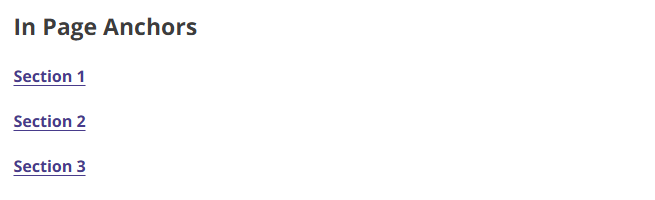
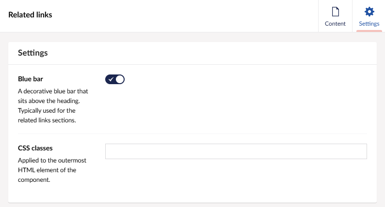

# TPR related links

A design component for a list of related links which can be re-used on TPR sites. This component is implemented using tag helpers and can be used in both ASP.NET applications and Umbraco.

## Example

```razor
@addTagHelper *, ThePensionsRegulator.Frontend

<tpr-related-links>
    <tpr-related-links-heading>Related links example heading</tpr-related-links-heading>
    <tpr-related-link href="/">Example link 1</tpr-related-link>
    <tpr-related-link href="/">Example link 2</tpr-related-link>
    <tpr-related-link href="/">Example link 3</tpr-related-link>
</tpr-related-links>
```

In ASP.NET applications the related links component is structured like so, replacing the example heading and example link placeholders with the required content.

If the tag helpers are arranged like the example above, then it should render the following html code:

```html
<nav>
    <div class="tpr-related-links">
        <h2 class="govuk-heading-m">Related links example heading</h2>
        <ul class="govuk-list">
            <li>
                <a href="/" class="govuk-link">Example link 1</a>
            </li>
            <li>
                <a href="/" class="govuk-link">Example link 2</a>
            </li>
            <li>
                <a href="/" class="govuk-link">Example link 3</a>
            </li>
        </ul>
    </div>
</nav>
```


## Umbraco

The 'TPR Related Links' block which is supported on the 'TPR Block Grid' component is used to implement this component in Umbraco. The most common uses of the related links component is for it to be used in the right-side column of the 'Two thirds / One third' column layout to present a list of links to other pages that may relate to the current content, or as a way to present the in-page anchor links.




To implement this component you should select the 'TPR related links' block:


Then you can add a relevant heading as well as whatever related links are needed for the page:


You can toggle the decorative blue bar typically used for when the related links component sits within the right-side column of the 'Two thirds / One third' column layout as well as include any additional css changes under the settings tab.



If the heading is left empty then it will search for a dictionary entry under the 'Translation' tab in Umbraco called 'TPR Related links heading', if there is no dictionary entry under that name then the heading will default to 'Related'.
