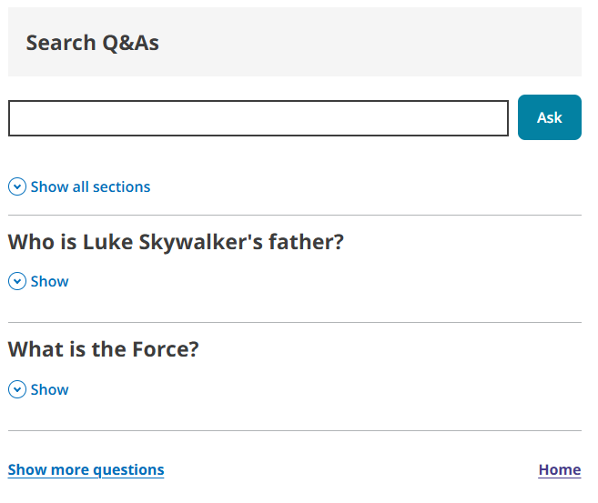

# Search results

You can add a search results component to your razor views by using the provided tag helper tags.

## Example
```razor
@addTagHelper *, ThePensionsRegulator.Frontend
<tpr-search-results popular-content-url="/SearchResultsData/popularContentExample.json" content-by-id-url="/SearchResultsData" search-content-url="/SearchResultsData/searchResults.json">
<tpr-search-results-input heading-level=2 govuk-heading-class="govuk-heading-m"></tpr-search-results-input>
    <tpr-search-results-footer-links>
        <a href="/">Home</a>
    </tpr-search-results-footer-links>
</tpr-search-results>
```




## API

### `<tpr-search-results>`
_Required_

| Attribute             | Type                   | Description  |
|-----------------------|------------------------|------------- |
| `popular-content-url` | `string`               | asd          |
| `content-by-id-url`   | `string`               | asdasd       |
| `search-content-url`  | `string`               | asdasdsa     |

### `<tpr-search-results-input>`
_Required_

Creates the label, input and button elements. Allows label title and heading to be overwritten.

| Attribute             | Type                  | Description   |
|-----------------------|-----------------------|---------------|
| `heading-level`       | `int`                 | asdaskl.jlj   |
| `govuk-heading-class` | `string`              | sdasdasd      |

### `<tpr-search-results-footer-links>`

Sets the HTML content for the footer. Child elements are required to be `a` tags. 

## Umbraco