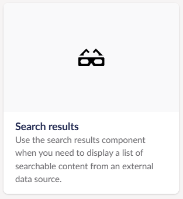
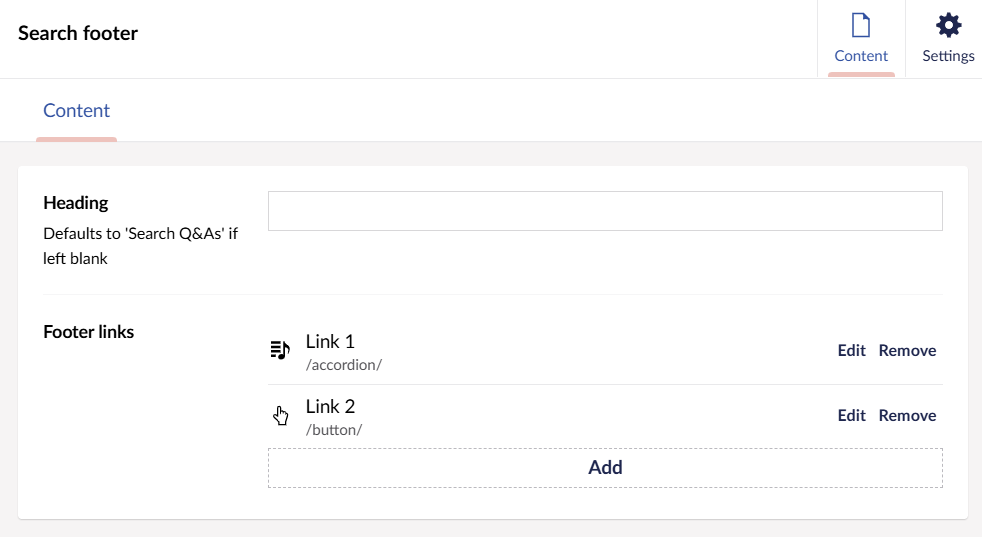
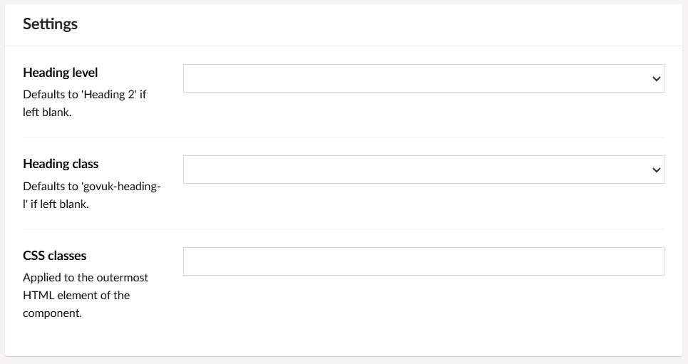
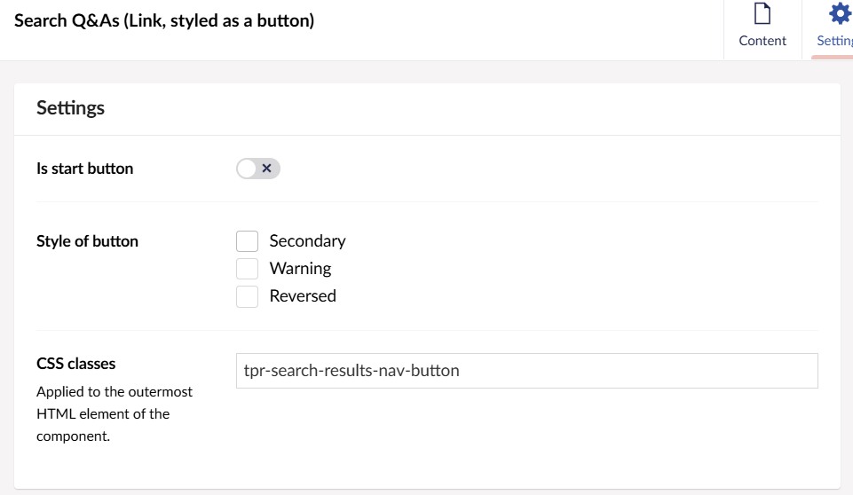

# Search results

You can add a search results component to your razor views by using the provided tag helper tags.

## Example

```razor
@addTagHelper *, ThePensionsRegulator.Frontend
<tpr-search-results popular-content-url="/SearchResultsData/popularContentExample.json" content-by-id-url="/SearchResultsData" search-content-url="/SearchResultsData/searchResults.json">
<tpr-search-results-input heading-level=2 govuk-heading-class="govuk-heading-m"></tpr-search-results-input>
    <tpr-search-results-footer-links>
        <a href="/">Home</a>
    </tpr-search-results-footer-links>
</tpr-search-results>
```


## API

### `<tpr-search-results>`

_Required_

| Attribute             | Type     | Description                                                                                                                              |
| --------------------- | -------- | ---------------------------------------------------------------------------------------------------------------------------------------- |
| `popular-content-url` | `string` | This should return a list of content to show when the page loads. The expected structure is documented below.                            |
| `content-by-id-url`   | `string` | This should return a singular result and allow the id of the item to be appended to the URL. The expected structure is documented below. |
| `search-content-url`  | `string` | This should return a list of keys that can be retrieved by id. The expected structure is documented below.                               |

### `<tpr-search-results-input>`

_Required_

Creates the label, input and button elements. Allows label title and heading to be overwritten.

| Attribute             | Type     | Default value   | Description                                                                                                                             |
| --------------------- | -------- | --------------- | --------------------------------------------------------------------------------------------------------------------------------------- |
| `heading-level`       | `int`    | 2               | The heading level which contains the heading text. Must be between 2 and 6                                                              |
| `govuk-heading-class` | `string` | govuk-heading-l | The class of the heading and must be one of the following 'govuk-heading-s', 'govuk-heading-m', 'govuk-heading-l' or 'govuk-heading-xl' |

### `<tpr-search-results-footer-links>`

Sets the HTML content for the footer. Child elements are required to be `a` tags.

## Umbraco

Add a `Search results` component anywhere in a block grid or block list using the `TPR block grid` data type.



The Search results block has the following content properties for configuration:

- **Heading** - Override the heading text. This defaults to `Search Q&As`.
- **Footer links** - Add other links that need to be displayed in the footer. Will always contain a `Show more questions` link.



The Search results component also has the following settings for configuration:

- **Heading level** - Select the heading level of the element which contains the heading text. Defaults to `Heading 2` if left blank.
- **Heading class** - Select the class to be applied to the heading. Defaults to `govuk-heading-l` if left blank.
- **CSS classes** - Applied to the outermost HTML element of the component.



This component should be accompanied with a `link, styled as a button` component using the CSS class `tpr-search-results__nav-button`. When clicked, it should navigate the user to the search results section on the page.



If JavaScript is not available then this component will not display and the accompanying button should take the user to the Q&A landing page in a new tab.

### Configuration

#### JavaScript

The JavaScript file `tpr-search-results.min.js` is provided as part of the `ThePensionsRegulator.Frontend` nuget package. This will need to be included in any view that uses this component outside of Umbraco.

```razor
@addTagHelper *, Microsoft.AspNetCore.Mvc.TagHelpers
<script
  src="/ThePensionsRegulator.Frontend/js/tpr-search-results.min.js"
  type="module"
  asp-append-version="true"
></script>
```

#### Appsettings

Three URLs are required to be configured to allow this component to show content.

`PopularContentUrl`
This should return a list of content to show when the page loads.
Example of the expected structure

```json
[
  {
    "name": "Who is Luke Skywalker's father?",
    "pageContent": "<p class=\"govuk-body\">Luke Skywalker's father is Anakin Skywalker, who later becomes known as Darth Vader.</p>"
  },
  {
    "name": "What is the Force?",
    "pageContent": "<p class=\"govuk-body\">The Force is a mystical energy field in the Star Wars universe that gives Jedi and Sith their power. It binds the galaxy together and can be used for both good and evil.</p>"
  },
  {
    "name": "What order should I watch the Star Wars movies in?",
    "pageContent": "<p class=\"govuk-body\">You can watch Star Wars movies in release order, chronological order, or the 'Machete Order.' Release order starts with Episode IV, while chronological order starts with Episode I.</p>"
  }
]
```

`ContentByIdUrl`
This should return a singular result and allow the id of the item to be appended to the URL.
Example of the expected structure

```json
{
  "key": "example1.json",
  "name": "Who trained Obi-Wan Kenobi?",
  "pageContent": "<p class=\"govuk-body\">Obi-Wan Kenobi was trained by Jedi Master Qui-Gon Jinn.</p>"
}
```

`SearchContentUrl`
This should return a list of keys that can be retrieved by id.
Example of the expected structure

```json
{
  "results": [
    {
      "key": "example1.json",
      "name": "Who trained Obi-Wan Kenobi?"
    },
    {
      "key": "example2.json",
      "name": "What is a lightsaber?"
    }
  ]
}
```

These are configured via the `appsettings.json` under a section named  `SearchResultsApiEndpoints`

```xml
"SearchResultsApiEndpoints": {
    "ContentByIdUrl": "/SearchResultsData/",
    "SearchContentUrl": "/SearchResultsData/searchResults.json",
    "PopularContentUrl": "/SearchResultsData/popularContentExample.json"
}
```

#### Search results relevance and popular results

A new setting has been introduced for this component to boost search results under a particular content section.

This can be controlled using the endpoint urls exposed in appsettings.json by implementing the ITprSearchResultsEndpointUrlProvider interface.

```csharp
public interface ITprSearchResultsEndpointUrlProvider
{
    TprSearchResultEndpoints GetSearchResultsEndpoints(Guid? searchBoostingCategory);
}
```

As part of this project a concrete implementation based on query string values is provided to append the search category page identifier to the popular content and search content api endpoints.

The provider ensures the category identifier is appended at the end of the relevant endpoints as illustrated below:

```html
<aside
  class=" tpr-search-results"
  data-content-by-id-url="/SearchResultsData/"
  data-popular-content-url="/SearchResultsData/popularContentExample.json?searchBoostingCategory=5e682cbe-b867-491a-955f-3382446d5663"
  data-search-content-url="/SearchResultsData/searchResults.json?searchBoostingCategory=5e682cbe-b867-491a-955f-3382446d5663"
>
  .....
</aside>
```
