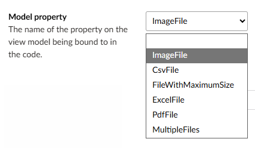

# How [ModelType] binds form components to view model properties

When using Umbraco add the `[ModelType(typeof(MyDocumentType))]` attribute to the action methods on your page controllers.

## Bind form components to your view model

When you add a block containing a form component, such as 'Text input' or 'Select', you need to set which property of your view model to bind the form component to. In the Settings for the component you can set the property from a dropdown list of properties on your view model.

The properties displayed in this dropdown list are read from your view model class based on the `[ModelType]` attribute on your controller. This works as follows:

1. The element type for the settings of the block in Umbraco uses a custom property editor, the 'Model Property Picker', defined in this repo.
2. The TypeScript definition of the property editor (`govuk-model-property-picker.ts`) calls a C# API, passing the document type alias of the page you're editing.
3. The C# API (`ModelPropertyController`) iterates through instances of `IModelPropertyProvider` to find matching properties.
4. The default implementation of `IModelPropertyProvider` document type alias of the page you're editing to look for a controller with a matching name.
5. It looks at the `[ModelType]` attribute on the `Index` method of the controller to find the type with properties to list.

You can register your own implementation of `IModelPropertyProvider` in dependency injection to add properties to this list from other sources.

## Form component views set the HTML `name` attribute

The property name selected in Umbraco is saved as a string. Views for blocks containing form components set this as the value of the `name` attribute in the HTML of the form component.

ASP.NET MVC model binding uses value of `name` to bind the submitted value to the field on your view model. This part of the process is just ASP.NET MVC and does not use `[ModelType]`.

Client-side validation also uses the `name` attribute as described below.

## Client-side validation uses the `name` attribute

Many blocks containing form components support ASP.NET client-side validation (see [Validation](./validation.md)). ASP.NET client-side validation works by adding HTML attributes that are recognised by the [jQuery Unobtrusive Validation](https://github.com/aspnet/jquery-validation-unobtrusive) JavaScript library.

To set these HTML attributes, we need to access the view model for the page. This lets us inspect the [System.ComponentModel.DataAnnotations](https://docs.microsoft.com/en-us/dotnet/api/system.componentmodel.dataannotations?view=net-5.0) attributes applied to each property on the view model, which defines the validation rules to apply.

We get the view model by iterating through instances of `IModelPropertyResolver` registered with dependency injection. By default there are two implementations:

- `DefaultModelPropertyResolver` gets the current view model from the `ViewData` for the page. This works for ASP.NET apps, but not for blocks in Umbraco. For blocks it returns the `BlockListItem` or `BlockGridItem` view model for the block, not the view model for the page.
- `ModelTypeAttributeModelPropertyResolver` gets the controller action for the page, and uses the `[ModelType]` attribute on the action to identify the view model for the page. This runs before `DefaultModelPropertyResolver` to ensure the correct result is returned.

Each view wraps a `<govuk-client-side-validation />` tag helper around the tag helper for the GOV.UK form component. This tag helper:

- gets a property on the view model for the page matching the `name` attribute on the form component, using `IModelPropertyResolver` instances as described above
- inspects the validation attributes on that property to determine the correct HTML attributes
- adds the HTML attributes.

You can register your own implementation of `IModelPropertyResolver` in dependency injection to get the property containing validation attributes from other sources.
