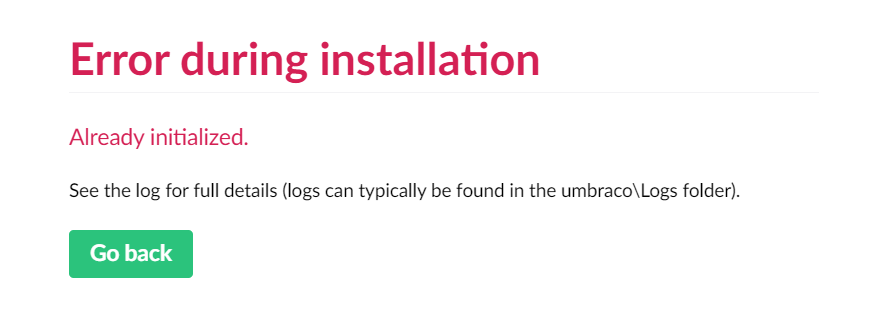

# Run the Umbraco example application

This repository includes an example application which demonstrates the validation working both client-side and server-side with messages configured in Umbraco.

1. Ensure you have .NET 6.0.5 (SDK version 6.0.300) or better installed. Run `dotnet --list-sdks` to check.
2. Clone this repo
3. Open `GovUk.Frontend.sln` in Visual Studio 2022 or better, click on the `GovUk.Frontend.Umbraco.ExampleApp` project, and run it.
4. When you see the Umbraco installer enter your name, email address and a new password and click 'Continue'.
5. When you are taken to the Umbraco backoffice go to Settings > uSync > Everything > Import all
6. View the example application at https://localhost:44350. If you want to see GOV.UK default styling, on the 'Settings' page in the 'Content' section of the Umbraco backoffice you can switch off The Pensions Regulator styles.

## Troubleshooting

### Error during installation: Already initialized

1. Stop IIS Express. This releases a file lock allowing you to delete files.
2. Delete the contents of your `GovUk.Frontend.Umbraco.ExampleApp\umbraco\Data` folder. This removes your existing SQLLite database.
3. Remove the `ConnectionStrings` section from `GovUk.Frontend.Umbraco.ExampleApp\appsettings.json`. It will be re-generated automatically.
4. Re-run the example application.
