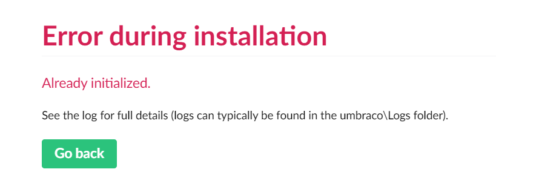
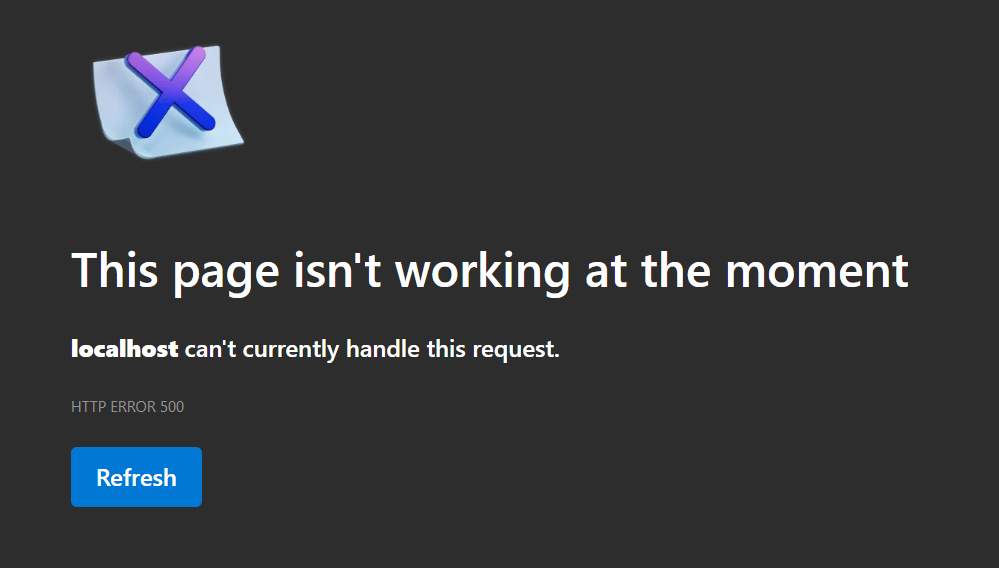

# Run the Umbraco example application

This repository includes an example application which demonstrates the validation working both client-side and server-side with messages configured in Umbraco.

1. Ensure you have .NET 10 installed.
2. Clone this repo.
3. Run `npm run govuk` to install the `govuk-frontend` npm package.
4. Open `GovUk.Frontend.sln` in Visual Studio 2026 or better.
5. Delete the `ConnectionStrings` section from `appsettings.json` in the `GovUk.Frontend.Umbraco.ExampleApp` project (it will get re-generated).
6. Click on the `GovUk.Frontend.Umbraco.ExampleApp` project, and run it.
7. When you see the Umbraco installer enter your name, email address and a new password and click 'Next'. Accept the defaults for other settings.
8. When you see the Umbraco login screen, enter the email address and password you just configured and click 'Login'.
9. When you are taken to the Umbraco backoffice go to 'Settings > uSync > Everything > Import'
10. Go to 'Settings > Languages > English (United States) > Delete'
11. View the example application at https://localhost:44350.
12. At this point the backoffice is not fully functional. Run `npm run backoffice` to build our backoffice components. This must be run after the main .NET build because it relies on a file generated by that build.

By default the example application uses The Pensions Regulator (TPR) branding. To see the GOV.UK branded version set `TPRStyles: false` in `appsettings.json` and re-run the application.

## Troubleshooting

### UNABLE_TO_GET_ISSUER_CERT_LOCALLY

If you get an error `UNABLE_TO_GET_ISSUER_CERT_LOCALLY` when running npm commands you need to click the padlock next to any site in the address bar of your browser, and download the CA certificate for your network in .PEM format. Then set the environment variable NODE_EXTRA_CA_CERTS to the path to that certificate, and restart Visual Studio.

### Error during installation: Already initialized

1. Stop IIS Express. This releases a file lock allowing you to delete files.
2. Delete the contents of your `GovUk.Frontend.Umbraco.ExampleApp\umbraco\Data` folder. This removes your existing SQLLite database.
3. Remove the `ConnectionStrings` section from `GovUk.Frontend.Umbraco.ExampleApp\appsettings.json`. It will be re-generated automatically.
4. Re-run the example application.

### 500 error during installation

This happens when your SQLLite database is configured in `appsettings.json`, but doesn't exist.

1. Delete the `ConnectionStrings` section from `appsettings.json`.
2. Re-run the example application.
3. If you see the Umbraco installer follow the steps above to complete the installation. The `ConnectionStrings` section will be put back into `appsettings.json` automatically.
4. If you still see the 500 error, it's happening for another reason. Look in `GovUk.Frontend.Umbraco.ExampleApp\umbraco\Logs` to find the error message.
